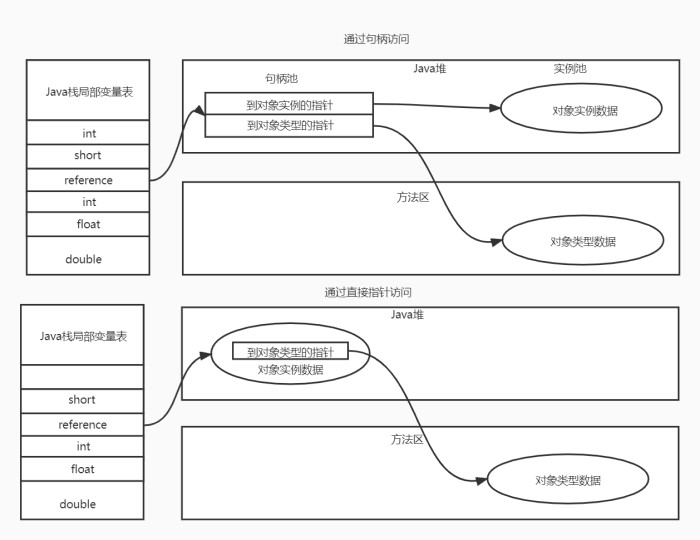

# 简介
许多Java程序员都会潜意识的把Java虚拟机与 OracleJDK 的 HotSpot 虚拟机等同看待,也许还有一些程序员会注意到 BEA JRockit 和 IBM J9 虚拟机,但绝大数人对Java虚拟机的认识就仅限于此了.从1996年初Sun发布的JDK1.0中包含的Sun Classic 虚拟机到今天,曾涌现,湮灭过许多经典,或优秀,或有特色的虚拟机出现.但其中最为人所熟知的一定是 HotSpot虚拟机,它是Sun/OracleJDK 和 OpenJDK 中默认的Java虚拟机,也是目前使用范围最广泛的Java虚拟机.
# Java内存区域
Java虚拟机在执行Java程序的过程中会把它所管理的内存划分为若干个不同的数区域.这些区域有各自的用途,以及创建和销毁的时间,有的区域随着虚拟机进程启动而一直存在,有些区域则是依赖用户线程的启动和结束而建立和销毁,根据<<Java虚拟机规范>>的规定,Java虚拟所管理的内存包含以下几个区域.
## 程序计数器
程序技术器(Program Counter Register)是一块较小的内存空间,它可以看作是当前线程所执行的字节码的行号指示器.在Java虚拟机的概念模型里,字节码解释器工作时就是通过改变这个计数器的值来选取下一条需要执行的字节码指令,他是程序控制流的指示器.**分支,循环,跳转,异常处理,线程恢复等基础功能都需要依赖这个计数器完成**.
由于Java虚拟机多线程是通过线程轮流切换,分配处理器执行时间的方式来实现的,在任何一个确定的时刻,一个处理器(对于多喝处理器来说是一个核心)都只会执行一条线程中的指令.因此,为了线程切换后能恢复到正确的执行位置,每条线程都需要一个独立的程序计数器,各个线程之间计数器互不影响,独立存储,我们称这类内存区域为"线程私有"的内存.
如果线程执行的是一个Java方法,这个计数器记录的是正在执行的虚拟机字节码指令地址;如果正在执行的是本地(Native)方法,这个计数器的值因改为空(Undefined).此内存区域是唯一一个在<<Java虚拟机规范>>中没有任何OutOfMemoryError情况的区域.
## Java虚拟机栈
与程序技术器一样Java虚拟机栈(Java Virtual Machine Stack) 也是线程私有的,它的生命周期与线程相同.虚拟机栈描述的是Java方法执行的线程内存模型:每个方法被执行的时候,Java虚拟机都会同步创建一个栈帧(Stack Frame) 用于存储局部变量表,操作数栈,动态链接吗,方法出口等信息.每个方法被调用直至执行完毕的过程,就对应着一个栈帧在虚拟机栈中从入栈到出栈的过程.
经常有人把Java内存区域笼统的划分为堆内存(Heap)和栈内存(Stack),这种划分方式直接继承自传统的C,C++程序的内存分布结构,在Java语言里就显得有些粗糙了,实际的内存区域划分要比这个更复杂.不过这种划分的方式流行也间接说明了程序员最关注的,与对象分配最密切的区域是"堆"和"栈"两块.其中的栈就是指的虚拟机栈,或者更多情况下指的是局部变量表的部分.
局部变量表存放了编译期可知的各种Java虚拟机基本数据类型(boolean,byte,char,short,int,float,long,double),对象引用(reference类型,她并不等同于对象本身,可能是一个指向对象起始地址的引用指针,也可能是一个代表对象的句柄或其他与此对象相关的位置)和returnAddress类型(指向了一条字节码指令的地址).
这些数据类型在局部变量表中的存储空间以局部变量槽(Slot)来表示,其中64位长度的long和double类型的数据会占用连哥哥变量槽,其余的数据类型只占用一个.局部变量表所需的内存空间在编译器完成分配,当进入一个方法时,这个方法需要在栈帧中分配多大的局部变量事情完全确定的,在方法运行期间不会改变局部变量表的大小(这里的大小是指变量槽的数量).
在<<Java虚拟机规范>>中,对这个内存区域规定了两类异常情况:如果线程请求的栈深度大于虚拟机栈所允许的深度,将抛出StackOverflowError异常;如果Java虚拟机栈容量可以动态扩展,当栈扩展时无法申请到足够的内存会抛出OutOfMemoryError异常.
## 本地方法栈
本地方法栈(Native Method Stacks)与虚拟机栈所发挥的作用是相似的,其区别只是虚拟机栈执行的为Java方法(也就是字节码)服务,而本地方法栈则是为虚拟机使用到的本地(Native)方法服务.
<<Java虚拟机规范>>对本地方法栈中使用的语言,使用方式与数据结构并没有任何强制规定,因此具体的虚拟机可以根据需要自由实现它,甚至有的Java虚拟机(HotSpot虚拟机)直接把本地方法栈和虚拟机栈合二为一.与虚拟机栈一样,本地方法栈也会抛出StackOverflowError和OutOfMemoryError.
## Java堆
对于Java程序员来说,Java堆(Java Heap)是虚拟机所管理的内存中最大的一块.Java堆是被所有线程共享的一块内存区域,再虚拟机启动时创建.此内存区域的唯一目的就是存放对象实例,Java里所有的对象实例都在这里分配内存.再<<Java虚拟机规范>>中对Java堆的描述是:"所有的对象实例以及数组都应带再堆上分配".
Java堆是垃圾收集管理的内存区域,从回收内存的角度来看,由于现代垃圾收集器大部分都是基于分代收集理论设计的,所以Java堆中经常会出现"新生代","老年代","永久代","Eden空间","From Survivor空间","ToSurvivor空间"等名词,如果从内存分配的角度来看,所有线程共享的Java堆可以划分出多个线程私有的分配缓冲区(Thread Local Allocation Buffer,TLAB),以提升对象分配时的效率.不过无论什么角度,无论如何划分,都不会改变Java队中存储共享的共性.Java堆既可以被实现成固定大小的,也可以是扩展的(通过参数-Xmx和-Xms设定).如果再Java堆中没有完成内存分配,并且堆无法扩展时,将会抛出OutofMemoryError异常.
## 方法区
方法区(Method Area)与Java堆一样,时各个 线程共享的内存区域,他用于存储已被虚拟机加载的类型信息,常量,静态变量,即使便器编译后的代码缓存等数据.收到方法区不得不提-下"永久代"这个概念,尤其是再JDK8以前,许多Java程序员都习惯在HotSpot虚拟机上开发,很多人愿意把方法区称呼为"永久代"(Permantent Generation),或者将两者混为一谈.本质上这两者并不是等价的,因为仅仅是当时的HotSpot虚拟机设计团队选择把收集器分代设计扩展至方法区,或者说是使用永久代来实现方法区.但是现在来看这并不一定是一个好主意,这导致Java应用更容易遇到内存溢出的问题(永久代有-XX:MaxPermSize的上限,即使不设置也有默认大小),考虑到HotSpot未来的发展,再JDK6的时候开发者团队就有放弃永久代,逐步改为采用本地内存(Native Memory)来实现方法区的计划了,到了JDK7的HotSpot,已经把原本存放在永久代的字符串常量池,静态变量等移至Java堆中,而到了JDK8,终于完全废弃了永久代的概念,改用本地内存中实现的元空间(Meta-space)来代替,把JDK7中剩余的内容(主要是类型信息)全部移植到元空间中.<<Java虚拟机规范>>中对方法区的约束时非常宽松的,除了和堆一样不需要连续的内存和可以选择固定大小和课扩展外,甚至还可以选择不实现垃圾收集.如果方法区无法满足新的内存分配将抛出OutOfMemoryError异常.
## 运行时常量池
运行时常量池(Runtime Constant Pool)时方法区的一部分.Class文件中除了有类的版本,字段,方法,接口等描述信息外,还有一项信息时常量池表(Constant Pool Table),用于存放编译期生成的各种字面量与符号引用,这部分内容时再类加载后存放到方法去的运行时常量池中.运行时常量池相对于Class文件常量池的一个重要特性是具备动态性,Java语言并不要求常量一定只有编译器才能产生,也就是说运行期间也可以将新的常量放入池中,这种特性被开发人员利用的比较多的便是`String` 类的`intern()`方法.
## 直接内存
直接内存(Direct Memory)并不是虚拟机运行时数据区的一部分,也不是<<Java虚拟机规范>>中定义的内存区域.但是这部分内存也被频繁的使用,而且也可能导致OutOfMemoryError异常.在JDK4中新加入了NIO(New Input/Output)类,引入了一种基于通道(Channel)与缓冲区(Buffer)的I/O方式,它可以使用Native幻术库直接分配对外内存,然后通过一个存储在Java堆里面的DirectByteBuffer对象作为这块内存的引用进行操作.这样能在一些场景中显著提高性能,因为避免了在Java堆和Native堆中来回复制数据.
# HotSpot虚拟机对象
究竟对象在虚拟机中是如何被创建的,在内存中是如何布局的,下面我们将深入探讨下HotSpot虚拟机在Java堆中对象分配,布局和访问的全过程
## 对象创建
在语言层面上对象创建通常(例外:复制,反序列化)仅仅是一个new 关键字而已,而在虚拟机中当收到一个new字节码指令后,首先会检查这个指令的参数能否在常量池中定位到一个类的符号引用,并且检查这个符号引用代表的类是否已被加载,解析和初始化过,如果没有,那必须先执行相应的类加载过程(加载,链接(分为:验证,准备,解析),初始化).接下来虚拟机将为对象分配内存,对象所需的内存大小在类加载完成后便可以确定.接下来,Java虚拟机还要堆对象进行必要的设置,例如这个对象是哪个类的实例,如何才能找出类的详细信息,对象的哈希码,对象GC分代年龄等信息.这些信息被存放在对象头(Object Header)中.根据当前运行状态不同,如是否启用偏向锁,对象头会有不通的设置方式.
在上面的工作完成后,从虚拟机的角度来看,一个新的对象产生了.但是从Java程序的角度来看,对象创建才刚开始.构造函数,即Class文件中`<init>()`方法还没有执行,所有的字段都默认为零值,对需要的资源和状态信息也还没有完全按照预定好的意图进行构造.一般来说new指令之后会跟随invokespecial指令来执行`<init>()`方法,这样一个真正可用对象才被构造出来.
## 对象内存布局
在HotSpot虚拟机里面,对象在堆内存中布局可以划分为三个部分:对象头(Header),实例数据(Instance Data),和对其填充(Paddding).HotSpot虚拟机对象的对象头包括两类信息.第一类信息用于存储对象自身运行时数据,如哈希码(HashCode),GC分代年龄,锁状态标志,线程持有的锁,线程偏向Id,偏向时间戳等,这部分数据的长度在32位和64位虚拟机中分别为32bit 和64bit,官方称为"Mark Word".对象需要存储的运行时数据有很多,实际已经超出了64位Bitmap结构所能记录的最大限度,所以Mark Word 被设计成一个可以动态定义的数据结构.
| 锁状态 | 25bit | 4bit |1bit | 2bit |
| :------| ------: | :------: |:------: |:------: |
| 无锁     | 对象的HashCode                 | 分代年龄 | 0    | 01 |
| 偏向锁   | 线程Id(23bit) ,偏向时间戳(2bit)| 分代年龄 | 1    | 01 |
| 轻量级锁 | 指向栈中锁记录的指针               |        |       | 00 |
| 重量级锁 | 指向重量级锁的指针                  |        |       | 10 |
| GC标记   | 空                              |        |       |  11|  
 
对象头的 另一部分是类型指针,即对象指向它类型元素的指针,Java虚拟机通过这个指针来确定是哪个类的实例.此外,如果对象是一个Java数组,那再对象头中还必须有一块用于记录数组长度的数据.接下来实例部分是真正存储有效的信息,即我们再代码里定义的字段内容,无论是从父类继承下来的,哈斯hi在子类中定义的字段都必须要记录起来.对象的第三部分是对其填充,这并不是必然存在的,也没有特别的含义,仅仅起着占位符的作用.由于HotSpot虚拟机的自动内存管理系统要求对象的起始地址必须是8字节的整数倍.
## 对象的访问定位
创建对象自然是为了后续使用该对象,我们的Java程序会通过栈上的reference数据来操作堆上具体的对象.由于reference类型在<<Java虚拟机规范>>里面之规定了它是一个指向对象的引用,并没有定义这个应用以具体什么方式访问堆中的对象,所以产生了两种主流的方法使用句柄和直接指针:
* 如果使用句柄访问的话,Java堆中可能会划分出一块内存地址来作为句柄池,reference中存储的对象地址就是句柄地址,而句柄中包含了对象实例数据与类型数据各自具体的地址信息
* 如果使用直接指针访问的话,Java堆中对象的内存布局就必须考虑如何放置访问类行数据的相关信息,reference中存储的直接就是对象地址,如果只是访问对象本身的话,就不需要多一次简介访问的开销

这两种访问对象的方式各有优势,使用句柄访问最大的好处就是reference中存储的是稳定的句柄地址,在对象被移动后只会改变句柄中实例数据的指针,而reference本身不需要修改,使用直接指针的好处就是熟读更快,节省了一次定位指针的开销.

